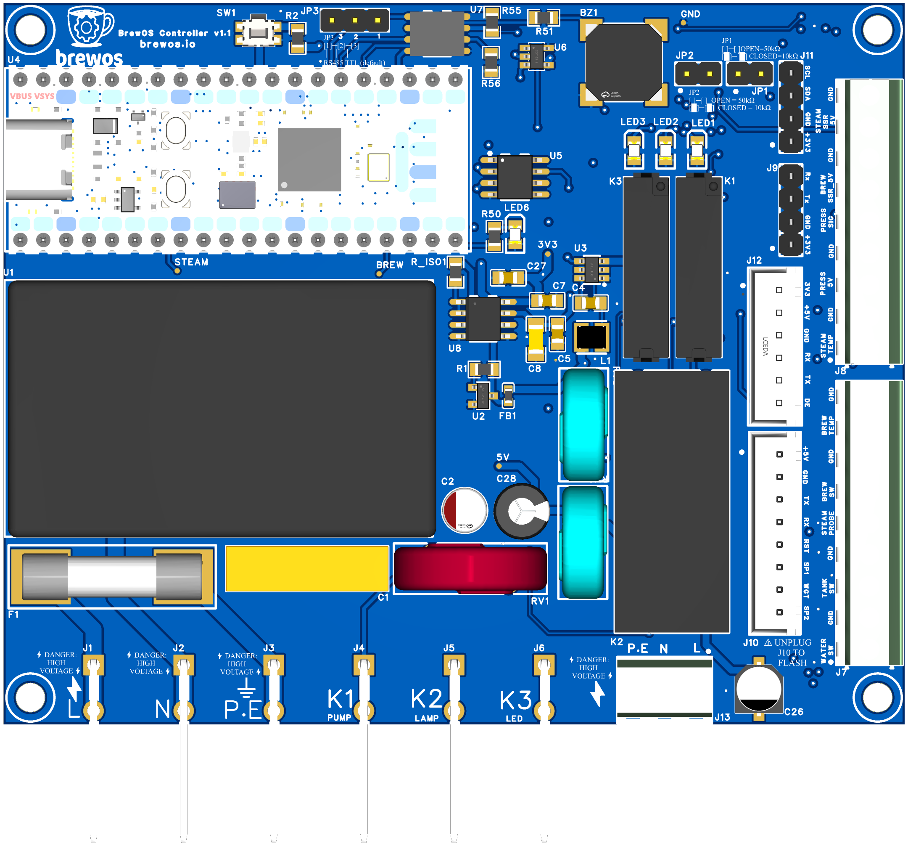
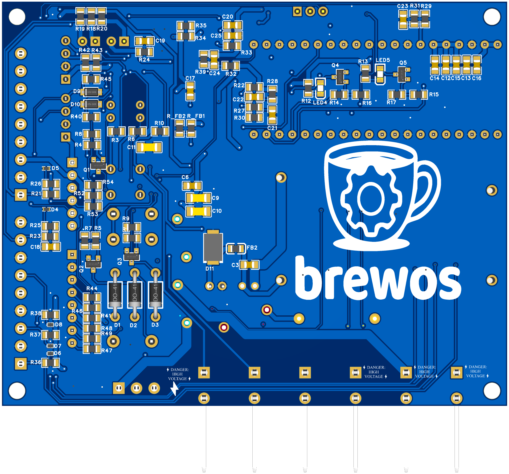

# Hardware Documentation

Custom control PCB for ECM Synchronika dual-boiler espresso machine.

**Current Version:** 2.28 (December 2025)

---

## 📋 Document Index

### Main Specification

| Document                                 | Description                                              |
| ---------------------------------------- | -------------------------------------------------------- |
| [**Specification.md**](Specification.md) | **Start here** - Overview and navigation to all sections |

### Detailed Specifications (`spec/` folder)

| Document                                      | Description                                         |
| --------------------------------------------- | --------------------------------------------------- |
| [Overview](spec/01-Overview.md)               | System architecture, design goals, electrical specs |
| [GPIO Allocation](spec/02-GPIO-Allocation.md) | Complete Pico 2 pin mapping, RP2350 errata          |
| [Power Supply](spec/03-Power-Supply.md)       | AC/DC isolation, buck converter, ADC reference      |
| [Outputs](spec/04-Outputs.md)                 | Relay drivers, SSR triggers, indicator LEDs         |
| [Analog Inputs](spec/05-Analog-Inputs.md)     | NTC thermistors, pressure transducer                |
| [Connectors](spec/06-Connectors.md)           | J1-J26 pinouts, wiring diagrams                     |
| [BOM](spec/07-BOM.md)                         | Complete bill of materials                          |
| [PCB Layout](spec/08-PCB-Layout.md)           | Layout guidelines, trace widths, zones              |
| [Safety](spec/09-Safety.md)                   | Protection circuits, compliance                     |

### Schematics & Reference

| Document                                                       | Description                                            |
| -------------------------------------------------------------- | ------------------------------------------------------ |
| [Schematic Reference](schematics/Schematic_Reference.md)       | Detailed ASCII circuit schematics with embedded images |
| [Component Reference](schematics/Component_Reference_Guide.md) | Component numbering and cross-reference                |
| [netlist.csv](schematics/netlist.csv)                          | Machine-readable net connections                       |

#### Schematic Images (December 2025)

All 9 schematic sheets are embedded in the [Schematic Reference](schematics/Schematic_Reference.md). Quick links:

| Sheet                                                                                                                      | Description                                    |
| -------------------------------------------------------------------------------------------------------------------------- | ---------------------------------------------- |
| 1 - [Power Supply](schematics/SCH_Schematic1_1-Power%20Supply_2025-12-22.png)                                              | AC/DC isolation, buck converter, ADC reference |
| 2 - [Microcontroller](schematics/SCH_Schematic1_2-Microcontroller%20%28Raspberry%20Pi%20Pico%202%29_2025-12-22.png)        | Pico 2 GPIO connections                        |
| 3 - [Relay Drivers](schematics/SCH_Schematic1_3-Relay%20Drivers_2025-12-22.png)                                            | K1-K3 driver circuits                          |
| 4 - [SSR Drivers](schematics/SCH_Schematic1_4-SSR%20Drivers_2025-12-22.png)                                                | Heater SSR triggers                            |
| 5 - [Sensor Inputs](schematics/SCH_Schematic1_5-Sensor%20Inputs_2025-12-22.png)                                            | NTC, pressure, level probe                     |
| 6 - [Communication](schematics/SCH_Schematic1_6-Communication%20Interfaces_2025-12-22.png)                                 | ESP32, RS485, debug port                       |
| 7 - [User Interface](schematics/SCH_Schematic1_7-User%20Interface_2025-12-22.png)                                          | LEDs, buzzer, reset                            |
| 8 - [Power Metering](schematics/SCH_Schematic1_8-Power%20Metering%20%28Universal%20External%20Interface%29_2025-12-22.png) | External meter interface                       |
| 9 - [Protection](schematics/SCH_Schematic1_9-Protection%20%26%20Filtering_2025-12-22.png)                                  | TVS, ESD, filtering                            |

#### PCB Layout

| Top Layer               | Bottom Layer                  |
| ----------------------- | ----------------------------- |
|  |  |

### Testing & Support

| Document                              | Description                        |
| ------------------------------------- | ---------------------------------- |
| [Test Procedures](Test_Procedures.md) | Manufacturing test and validation  |
| [ESP32 Wiring](ESP32_Wiring.md)       | Display module integration         |
| [CHANGELOG](CHANGELOG.md)             | Version history and design changes |

---

## 🎯 Project Overview

### What This Board Does

Plug & play replacement for the factory GICAR control board and PID controller:

- **Temperature Control:** Dual PID for brew and steam boilers (NTC sensors)
- **Pressure Monitoring:** Real-time brew pressure via 0.5-4.5V transducer
- **Power Metering:** External module support (PZEM, JSY, Eastron)
- **Smart Features:** Brew-by-weight, shot timers, profiles via ESP32 display
- **Connectivity:** WiFi, MQTT, OTA updates via ESP32

### Key Design Principles

| Principle       | Implementation                                     |
| --------------- | -------------------------------------------------- |
| **Plug & Play** | Uses original machine connectors (6.3mm spades)    |
| **Reversible**  | No permanent modifications to machine              |
| **Safe**        | HV isolated from control circuits, proper creepage |
| **Universal**   | 100-240V AC, 50/60Hz worldwide                     |

---

## 🔌 Connector Quick Reference

### High Voltage (220V AC)

| Connector | Type                 | Function                            |
| --------- | -------------------- | ----------------------------------- |
| J1        | 6.3mm Spade (2-pin)  | Mains input (L, N only - PE removed) |
| J2-J4     | 6.3mm Spade          | Relay outputs (LED, Pump, Solenoid) |
| J5        | 6.3mm Spade          | Chassis Reference (SRif)           |
| J24       | Screw Terminal 2-pos | Power meter HV (L fused, N only - PE removed) |

### Low Voltage (3.3V/5V)

| Connector | Type                  | Function                                           |
| --------- | --------------------- | -------------------------------------------------- |
| J26       | Screw Terminal 18-pos | All sensors & SSR control                          |
| J15       | JST-XH 8-pin          | ESP32 display + brew-by-weight + expansion (Pin 8) |
| J17       | JST-XH 6-pin          | Power meter UART/RS485                             |

---

## ⚙️ Configuration Jumpers

| Jumper  | Default | Function                                               |
| ------- | ------- | ------------------------------------------------------ |
| **JP1** | OPEN    | Brew NTC: OPEN=50kΩ (ECM), CLOSE=10kΩ (Rocket/Gaggia)  |
| **JP2** | OPEN    | Steam NTC: OPEN=50kΩ (ECM), CLOSE=10kΩ (Rocket/Gaggia) |
| **JP3** | OPEN    | Power meter voltage: OPEN=5V, CLOSE=3.3V               |
| **JP4** | 1-2     | Power meter type: 1-2=RS485, 2-3=TTL                   |

**See:** [Component Reference Guide](schematics/Component_Reference_Guide.md) for complete component listings.

---

## 🛒 What to Order

### PCB Components (on board)

See [BOM](spec/07-BOM.md) for complete bill of materials.

### User-Supplied (external)

| Item            | Specification                | Notes                          |
| --------------- | ---------------------------- | ------------------------------ |
| NTC Sensors     | 50kΩ @ 25°C (or 10kΩ)        | Machine-dependent, see JP2/JP3 |
| Pressure Sensor | **0.5-4.5V ratiometric**     | G1/4" or 1/8" NPT thread       |
| Power Meter     | PZEM-004T, JSY-MK-163T, etc. | External module with CT clamp  |
| SSRs            | 40A solid state relay × 2    | For brew and steam heaters     |

---

## 🔧 Machine Compatibility

### Tested

- ✅ ECM Synchronika (primary target)

### Should Work (same NTC config)

- ECM Mechanika, Profitec Pro 700/800

### Requires JP1/JP2 Change

- Rocket Appartamento/Giotto (10kΩ NTC)
- Rancilio Silvia (10kΩ NTC)
- Gaggia Classic (10kΩ NTC)

---

## 📁 Related Documentation

- **Firmware:** `docs/pico/` - Pico firmware and power metering integration
- **Web Interface:** See `app/` repository - React dashboard and settings
- **ESP32 Display:** `src/esp32/` - Display module firmware

---

## ⚠️ Safety Warnings

1. **Mains Voltage:** This board handles 220V AC. Only qualified personnel should install.
2. **Isolation:** Maintain >6mm creepage between HV and LV circuits.
3. **Grounding:** PCB uses SRif (Chassis Reference) architecture - connect J5 to chassis via 18AWG wire. No PE connection on PCB HV side.
4. **Fusing:** 10A fuse (F1) protects relay loads. Heaters use machine's existing fusing.

---

_For detailed specifications, start with [Specification.md](Specification.md)._
