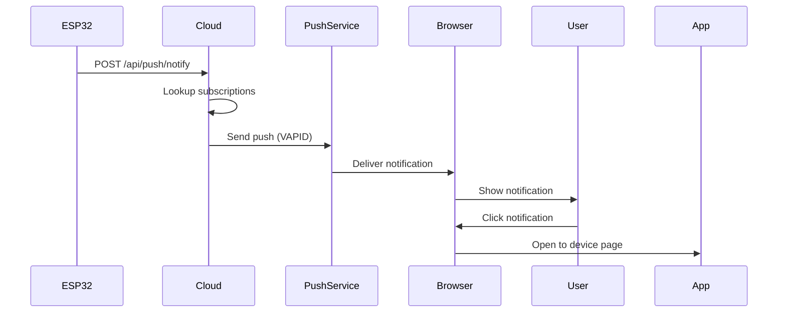

# Push Notifications

BrewOS supports push notifications to alert you when your espresso machine needs attention, even when you're away from the device.

## Overview

Push notifications are delivered through the web browser's Push API, allowing you to receive alerts:
- **When the app is closed** - Notifications work in the background
- **On any device** - Works on desktop and mobile browsers
- **Real-time** - Instant delivery when events occur
- **Actionable** - Click to open the app directly to the relevant screen

## Supported Notifications

### Reminders

| Type | Description | When Triggered |
|------|-------------|----------------|
| **Machine Ready** | Machine has reached brewing temperature | Brew temp stable |
| **Water Empty** | Water tank needs refill | Tank sensor triggered |
| **Descale Due** | Time to descale the machine | X days since last descale |
| **Service Due** | Maintenance recommended | Shot counter threshold reached |
| **Backflush Due** | Backflush reminder | Daily/weekly schedule |

### Alerts (Critical)

| Type | Description | When Triggered |
|------|-------------|----------------|
| **Machine Error** | Machine needs attention | Any Pico alarm |
| **Pico Offline** | Control board disconnected | UART timeout > 30s |

## Setup

### For Users

1. **Open Settings:**
   - Navigate to Settings > System (cloud mode only)
   - Find "Push Notifications" section

2. **Enable Notifications:**
   - Click "Enable Push Notifications"
   - Grant browser permission when prompted

3. **Verify Subscription:**
   - Check that status shows "Active"
   - Service Worker should be "Registered"
   - Permission should be "Granted"

### For Administrators

#### Cloud Server Setup

1. **Generate VAPID Keys:**
   ```bash
   cd src/cloud
   npx web-push generate-vapid-keys
   ```

2. **Add to Environment:**
   ```env
   VAPID_PUBLIC_KEY=your-public-key-here
   VAPID_PRIVATE_KEY=your-private-key-here
   VAPID_SUBJECT=mailto:admin@brewos.app
   ```

3. **Restart Server:**
   ```bash
   npm run start
   ```

#### ESP32 Configuration

The ESP32 automatically sends notifications to the cloud when:
- Cloud URL is configured in settings
- Device is claimed by a user
- WiFi is connected

No additional ESP32 configuration needed.

## How It Works

### Architecture

```
ESP32 → Cloud Server → Push Service → User's Browser
```

1. **ESP32 detects event** (e.g., water empty, machine ready)
2. **Sends notification to cloud** via HTTP POST to `/api/push/notify`
3. **Cloud server looks up subscriptions** for device owner
4. **Sends push notification** to all subscribed browsers
5. **Service worker receives notification** and displays it
6. **User clicks notification** to open app

### Notification Flow



## API Reference

### Client API

#### Subscribe to Push Notifications

**Endpoint:** `POST /api/push/subscribe`

**Authentication:** Required (Google OAuth)

**Request:**
```json
{
  "subscription": {
    "endpoint": "https://fcm.googleapis.com/...",
    "keys": {
      "p256dh": "base64-encoded-key",
      "auth": "base64-encoded-key"
    }
  },
  "deviceId": "BRW-12345678" // Optional
}
```

**Response:**
```json
{
  "success": true,
  "subscription": {
    "id": "uuid",
    "user_id": "user-id",
    "device_id": "BRW-12345678",
    "endpoint": "https://...",
    "created_at": "2024-01-01T00:00:00Z"
  }
}
```

#### Unsubscribe from Push Notifications

**Endpoint:** `POST /api/push/unsubscribe`

**Authentication:** Required (Google OAuth)

**Request:**
```json
{
  "subscription": {
    "endpoint": "https://fcm.googleapis.com/...",
    "keys": {
      "p256dh": "base64-encoded-key",
      "auth": "base64-encoded-key"
    }
  }
}
```

**Response:**
```json
{
  "success": true
}
```

#### Get VAPID Public Key

**Endpoint:** `GET /api/push/vapid-key`

**Response:**
```json
{
  "publicKey": "base64-encoded-vapid-public-key"
}
```

#### List Subscriptions

**Endpoint:** `GET /api/push/subscriptions`

**Authentication:** Required (Google OAuth)

**Response:**
```json
{
  "subscriptions": [
    {
      "id": "uuid",
      "user_id": "user-id",
      "device_id": "BRW-12345678",
      "endpoint": "https://...",
      "created_at": "2024-01-01T00:00:00Z"
    }
  ]
}
```

### ESP32 API

#### Send Notification

**Endpoint:** `POST /api/push/notify`

**Authentication:** None (device ID is the auth)

**Request:**
```json
{
  "deviceId": "BRW-12345678",
  "notification": {
    "type": "WATER_EMPTY",
    "message": "Please refill the water tank",
    "timestamp": 1704067200,
    "is_alert": false
  }
}
```

**Notification Types:**
- `MACHINE_READY`
- `WATER_EMPTY`
- `DESCALE_DUE`
- `SERVICE_DUE`
- `BACKFLUSH_DUE`
- `MACHINE_ERROR`
- `PICO_OFFLINE`

**Response:**
```json
{
  "success": true,
  "sentCount": 2
}
```

## Notification Preferences

Users can configure notification preferences on the ESP32:

- **Push Enabled** - Global toggle for all push notifications
- **Machine Ready Push** - Notify when machine is ready
- **Water Empty Push** - Notify when water is empty
- **Maintenance Push** - Notify for descale/service/backflush reminders
- **Alerts** - Always sent (machine errors, Pico offline)

Preferences are stored in ESP32 NVS and respected when sending to cloud.

## Troubleshooting

### Notifications Not Received

1. **Check subscription status:**
   - Go to Settings > System > Push Notifications
   - Verify subscription is "Active"
   - Check permission is "Granted"

2. **Check browser support:**
   - Chrome/Edge: ✅ Full support
   - Firefox: ✅ Full support
   - Safari: ❌ Not supported (no Push API)

3. **Check service worker:**
   - Open DevTools > Application > Service Workers
   - Verify service worker is active
   - Check for errors in console

4. **Check cloud server:**
   - Verify VAPID keys are configured
   - Check server logs for errors
   - Verify device is claimed

5. **Check ESP32:**
   - Verify cloud URL is configured
   - Check WiFi connection
   - Verify device is claimed

### Permission Denied

If permission is denied:

1. **Reset in browser:**
   - Chrome: Settings > Privacy > Site Settings > Notifications
   - Firefox: Preferences > Privacy & Security > Permissions > Notifications
   - Find BrewOS and reset permission

2. **Re-enable in app:**
   - Go to Settings > System > Push Notifications
   - Click "Enable Push Notifications" again

### Subscription Not Persisting

If subscription is lost:

1. **Check database:**
   - Verify subscription is stored in cloud database
   - Check user ID matches

2. **Re-subscribe:**
   - Unsubscribe and re-subscribe
   - Check for errors in console

### Notifications Not Sending from ESP32

1. **Check cloud URL:**
   - Verify cloud URL is set in ESP32 settings
   - Test connectivity: `curl https://your-cloud-url/api/health`

2. **Check device ID:**
   - Verify device ID format: `BRW-XXXXXXXX`
   - Check device is claimed

3. **Check notification preferences:**
   - Verify push is enabled in ESP32 settings
   - Check notification type is enabled

4. **Check logs:**
   - ESP32 serial output should show: `[Cloud] Notification sent: TYPE`
   - Cloud server logs should show push delivery

## Security

### VAPID Keys

- **Private key** - Never exposed, stored only on server
- **Public key** - Shared with clients for subscription
- **Subject** - Email or URL identifying the sender

### Subscription Security

- **User authentication** - Required for subscription management
- **Device ownership** - Verified before sending notifications
- **Endpoint validation** - Only valid push service endpoints accepted

### Notification Content

- **No sensitive data** - Only machine status and alerts
- **User-specific** - Only sent to device owner
- **Rate limiting** - Prevents notification spam

## Development

### Testing Push Notifications

1. **Local testing:**
   ```bash
   # Start cloud server
   cd src/cloud
   npm run dev
   
   # Start web app
   cd src/web
   npm run dev
   ```

2. **Test subscription:**
   - Open app in browser
   - Enable push notifications
   - Check DevTools > Application > Service Workers

3. **Test sending:**
   ```bash
   curl -X POST http://localhost:3001/api/push/notify \
     -H "Content-Type: application/json" \
     -d '{
       "deviceId": "BRW-12345678",
       "notification": {
         "type": "MACHINE_READY",
         "message": "Machine is ready",
         "timestamp": 1704067200,
         "is_alert": false
       }
     }'
   ```

### Debugging

**Service Worker:**
- Open DevTools > Application > Service Workers
- Check "Update on reload" for development
- View console logs in service worker context

**Push Events:**
- Service worker logs push events: `[SW] Push notification received`
- Check notification payload in service worker console

**Cloud Server:**
- Check logs for subscription management
- Verify VAPID key generation
- Monitor push delivery success/failure

## Best Practices

1. **Respect user preferences** - Only send enabled notification types
2. **Handle errors gracefully** - Remove invalid subscriptions automatically
3. **Rate limit notifications** - Prevent notification fatigue
4. **Provide clear actions** - Make notifications actionable
5. **Test on multiple browsers** - Ensure cross-browser compatibility

